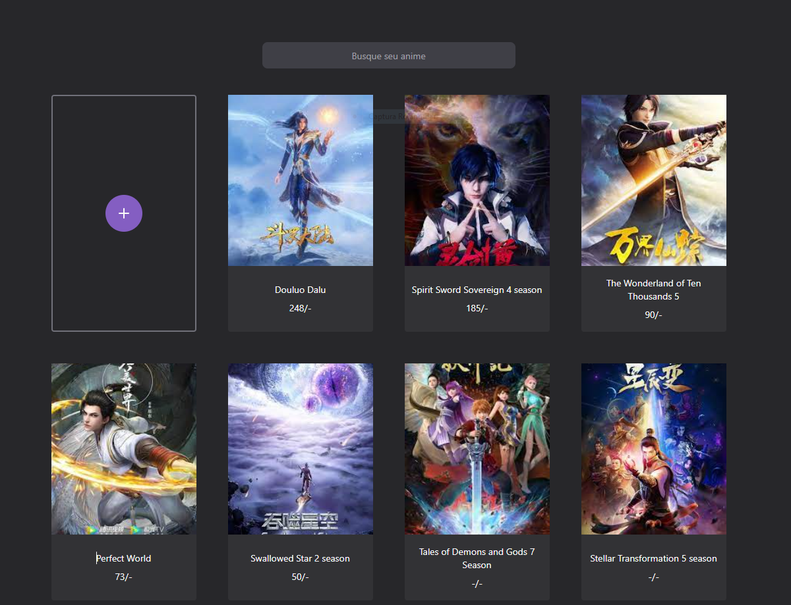

<h4 align="center">
   Projeto para aplicar a ideia do clean architecture em projeto front-end
</h4>

<h4 align="center">
   NextJs + TypeScript + TailWind + Clean Architecture
</h4>


<h1 align="center">
    
</h1>


## :bulb: Instalação

Abaixe o projeto com 
```shell
git clone https://github.com/thelokys/open-anime.git # HTTPS
ou
git clone git@github.com:thelokys/open-anime.git # SSH
ou
gh repo clone thelokys/open-anime # Git CLI
```
## :rocket: Executando projeto

Entre da pasta do projeto `cd open-anime`

Dentro da pasta execute `npm install` para baixar as dependências

Execute a aplicação

- `npm run dev`

Execute os testes de aplicação

- `npm run test`

## :computer: Tecnologias
  
Tecnologias utilizada:
- [Framework - Nextjs](https://nodejs.org/en/)
---
